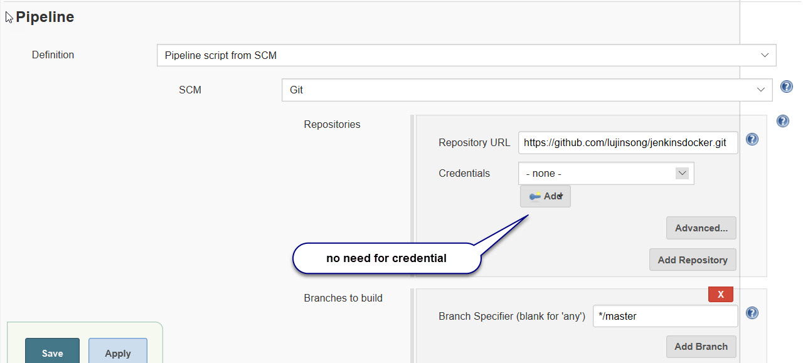

# Building Docker Image with Jenkins

## Create Express nodejs project
``` 
    #install express-generator. https://code.visualstudio.com/tutorials/nodejs-deployment/express
    npm install -g express-generator
    cd ~
    mkdir jenkinsdocker
    cd ~/jenkinsdocker
    # tell express-generator to use pug template engine(know as jade before) and create a .gitignor file.
    express -view pug --git    
``` 
## Create a github repository
    
``` 
   # create a git repository under your github account, then run the command below
    cd ~/jenkinsdocker
    git init
    git add -A
    git commit -m "first commit"
    git remote add origin https://github.com/[your git hub account]/jenkinsdocker.git
    git push -u origin master
``` 
## Set up Dockerfile, which will be used to create docker image.
Dockerfile
```
# use a node base image
FROM node:7-onbuild
# set maintainer
LABEL maintainer "lu_jasper@yahoo.com"
# set health check
HEALTHCHECK --interval=5s\
       --timeout=5s\
       CMD curl -f http://127.0.0.1:3000|| exit 1
# tell docker which port to expose
EXPOSE 3000 
```
Since it use the official node base image onbuild, it inherits the following actions.
1. Copy all the files in the current directory to /usr/src/app folder inside the container image
2. Run npm install to install any dependencies for the app
3. Specify npm start as the command when the container starts, similar to the Docker Command "Run npm start" 
## Create pipeline configuration inside the Jenkinsfile, so it becomes part of the application code. Replace where lujasper is with your docker hub user name. You will need to create a docker hub repository first at hub.docker.com. Jenkinsdocker is the project name.
Jenkinsfile
```
node{
    def app
    stage('Clone Repository'){
        /* let's make sure we have the repository cloned to our workspace */
        checkout scm
    }
    stage('Build image'){
        /* Build docker image, similar to docker build on the command line */
        app = docker.build("lujasper/devops:jenkinsdocker")
    }
    stage('Test image')
    {
        /* put npm test command here once configured test */
        app.inside{
            sh 'echo "Tests passed"'
        }
    }
    stage('Push image')
    {
        /*Using docker with pipeline https://jenkins.io/doc/book/pipeline/docker/*/
        docker.withRegistry('https://registry.hub.docker.com','docker-hub-credentials'){
            /*app.push("${env.BUILD_NUMBER}")
            app.push("latest")
                add this image to lujasper/devops repository, tag it as jenkinsdocker
            */
            app.push("jenkinsdocker")
        }
    }
}
```
## Run the jenkins docker image build lujasper/devops:jenkins. Learn how to build it, please follow the steps [here](https://github.com/lujinsong/devops/tree/master/Jenkins). You may noticed that the local storage is involved to persist the configuration you performed. You must make sure the path "c:/devops/jenkins" is valid. 

```
mkdir c:/devops/jenkins
docker run -d -v c:/devops/jenkins:/var/jenkins_home -p 8080:8080 -p 50000:50000 --name jenkins  lujasper/devops:jenkins   
docker exec -ti jenkins bash
```
## Create pipeline to build, test JenkinsDocker, then build the image and push it to docker hub.
### Create global credential for docker hub. You will need to create a docker repository first. 
1. Click Credentials in the left menu and System once it appears. Then click Global credentials at the right and you will see the screen below.Change lujasper to your docker hub account name. 


2. Create Jenkin pipeline for the project jenkinsdocker. At Jenkins home page, click New Item and select Pipeline.

   > Description. Add any description for this build.   
   > Build triggers. Select Poll SCM and set it to check check sum every 5 min.  
     
   > Pipeline. Definition: Build, test, create docker image and push to docker hub.
     
   > Script Path. Put Jenkinsfile as it is under your project folder. The pipeline will pick it up and run the scripts.   
     
   > Save the pipeline.
3. Once saved, check out the build log. Hover over the Green or Red block and select Logs icon to view the details.

4. If build is successful, the image should occur in the docker hub.

## Run the image lujasper/devops:jenkinsdocker
```
docker run -d -p 3000:3000 --name jenkinsdocker lujasper/devops:jenkinsdocker
```
http://localhost:3000

